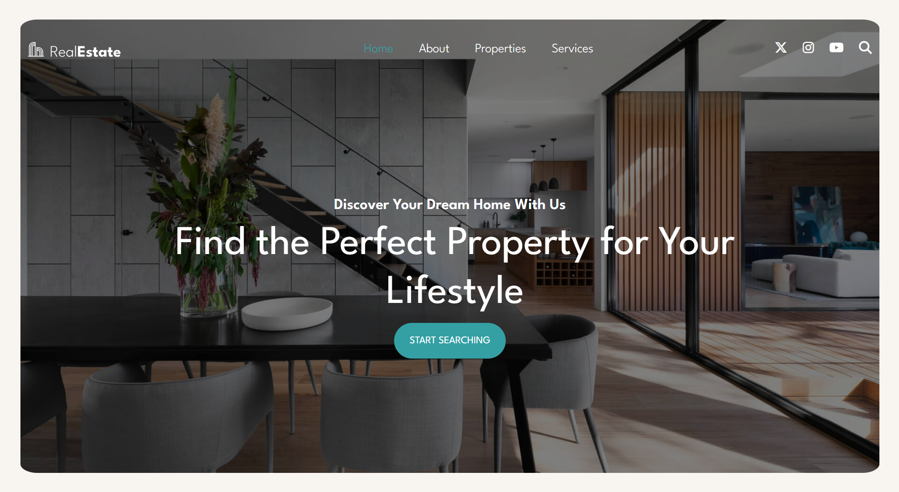
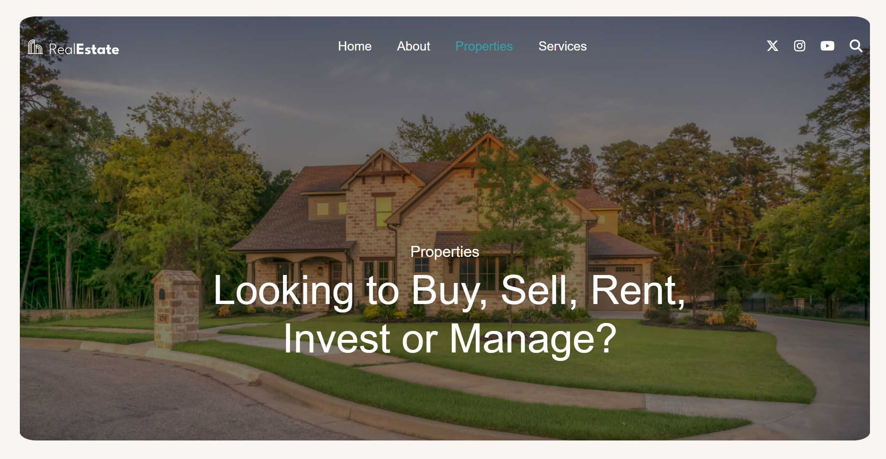
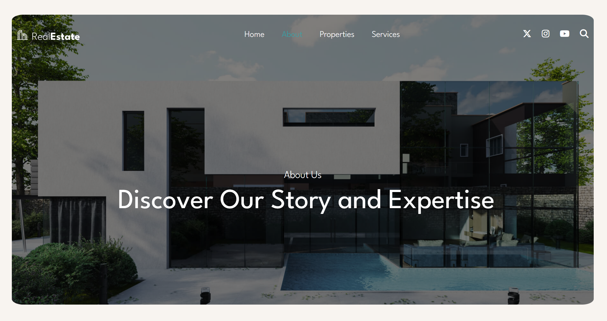

# Real Estate Website

A modern, responsive real estate website for finding rental properties ranging from affordable to luxury homes. This frontend-only project showcases property listings with a clean, professional design.

## 🏠 Features

- **Responsive Design** - Works seamlessly on desktop, tablet, and mobile devices
- **Property Listings** - Browse featured properties with detailed information
- **Modern UI/UX** - Clean and intuitive user interface
- **Contact Forms** - Easy inquiry and appointment scheduling
- **Social Media Integration** - Connect through various social platforms
- **SEO Optimized** - Meta tags and structured content for better search visibility

## 🛠️ Tech Stack

- **HTML5** - Semantic markup and structure
- **CSS3** - Custom styling with modern features
- **Bootstrap 5** - Responsive grid system and components
- **FontAwesome 6** - Icons and social media symbols
- **Google Fonts** - League Spartan typography
- **JavaScript** - Interactive navigation and form handling

## 📱 Pages

- **Home** - Hero section with featured properties
- **About** - Company story and team information
- **Properties** - Property listings and search
- **Services** - Real estate services offered
- **Contact** - Contact form and company details

## 🚀 Demo

**Live Demo:** [Your Demo Link Here](https://your-demo-link.com)

## 📸 Screenshots





## 🎨 Design Features

- Dark overlay effects on hero images
- Smooth hover animations
- Mobile-first responsive design
- Professional color scheme (#34a0a4, #f8f4f0)
- Modern typography with League Spartan font

## 📁 Project Structure

```
Real-Estate-Website/
├── index.html
├── about.html
├── properties.html
├── services.html
├── contact.html
├── assets/
│   ├── styles/
│   │   └── style.css
│   └── images/
│       ├── hero-bg.jpg
│       ├── feature-01.jpg
│       └── ...
└── README.md
```

## 🚀 Getting Started

1. Clone the repository
```bash
git clone https://github.com/yourusername/real-estate-website.git
```

2. Open `index.html` in your browser
```bash
cd real-estate-website
open index.html
```

## 🙏 Acknowledgments

- **Bootstrap Team** - For the amazing CSS framework
- **FontAwesome** - For the comprehensive icon library
- **Google Fonts** - For the beautiful League Spartan typography
- **Unsplash/Pexels** - For high-quality stock images
- **Amazon Q Developer** - For development assistance and code optimization
- **Open Source Community** - For freely available resources and inspiration

## 👨‍💻 Developer

**Kishan Rajput**
- Frontend Developer
- Created with passion for modern web design

## 📄 License

This project is open source and available under the [MIT License](LICENSE).

## 🔮 Future Enhancements

- Backend integration for dynamic content
- Property search and filtering
- User authentication system
- Property comparison feature
- Interactive maps integration
- Payment gateway integration

---

⭐ If you found this project helpful, please give it a star!